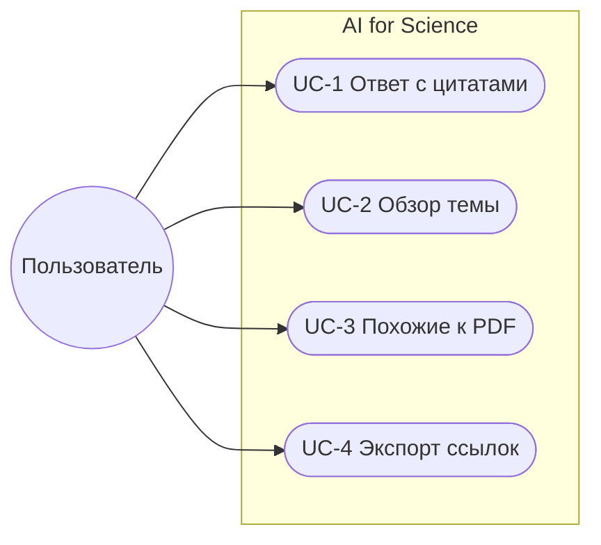
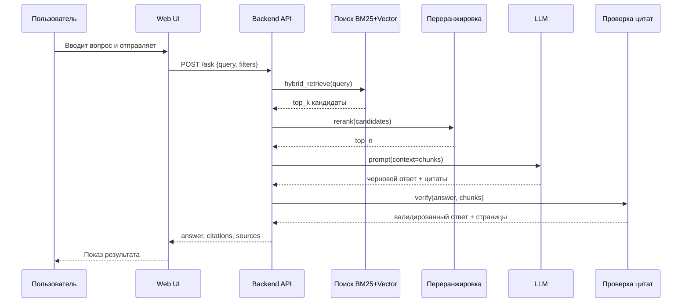

# Use-case Narrative — AI for Science

Документ для репозитория: `docs/use-cases.md`

Цель: описать ключевые сценарии, альтернативные пути, ошибки и ценность.

## Актеры и система
- Пользователь: студент, исследователь, ML инженер.
- Веб UI: форма поиска, просмотр результатов, предпросмотр цитат, загрузка PDF.
- Backend API: FastAPI эндпойнты `/search`, `/ask`, `/doc/{id}`.
- Поисковая подсистема: BM25 индекс и векторная БД, переранжировка.
- Внешние источники: arXiv, Crossref, Semantic Scholar.
- Парсер PDF и экстрактор цитат.

---

## UC-1 Ответ на конкретный вопрос с цитатами (главный сценарий)
**Цель**: получить короткий точный ответ на исследовательский вопрос с цитатами и страницами.

**Предусловия**: сервис доступен, индексы собраны.

**Постусловия**: пользователь видит ответ, список источников, может открыть PDF и сохранить результат.

### Happy Path
1. Пользователь вводит вопрос в строке поиска и жмет Enter.
2. UI валидирует ввод, показывает лоадер и отправляет `POST /ask { query, filters }`.
3. Backend формирует расширенный запрос: оригинал плюс синонимы и годовые фильтры.
4. Backend делает гибридный поиск: BM25 и векторный индекс возвращают top 50 кандидатов.
5. Переранжировка cross-encoder сокращает список до top 10.
6. Алгоритм MMR выбирает 3–5 непересекающихся чанков.
7. Backend собирает промпт и вызывает LLM для чернового ответа.
8. Модуль валидации проверяет, что каждый факт поддержан выделенным текстом из чанков.
9. Извлекаются номера страниц из метаданных чанков.
10. Backend возвращает UI `answer, citations, sources, timing`.
11. UI рендерит ответ. Кнопка Показать цитаты раскрывает цитаты с ссылками на страницы.
12. Пользователь открывает 1–2 источника и сохраняет результат в заметки или экспортирует ссылки.
13. События аналитики фиксируют успех сессии.

### Alternative Flows
A1. Слабый интернет у пользователя
- UI показывает офлайн-бар. Ввод не теряется. При восстановлении связи запрос отправляется повторно.

A2. Пустая выдача
- Backend не нашел релевантные документы. UI показывает блок Ничего не нашли и предлагает 3 переформулировки и снять фильтры.

A3. Язык запроса отличается от языка корпусов
- Детектируется язык. Backend делает перевод запроса на английский и отправляет параллельные поиски. UI показывает бейдж Переведен.

A4. Перегрев индексов под нагрузкой
- Backend откатывается в режим только BM25. UI показывает бейдж Упрощенный поиск. Результаты приходят быстрее, но без векторного ранжирования.

A5. Слишком длинный или шумный запрос
- Backend сокращает запрос до ключевых фраз. UI показывает подсказку Попробуйте короче и кнопку Принять сокращение.

### Error Handling (UC-1)
E1. Некорректный ввод
- Условие: пустая строка или меньше 3 значимых символов.
- Что видит пользователь: ошибка под полем ввода Текст запроса слишком короткий.
- Действие системы: статус 400, подсветка поля, без сетевых вызовов.

E2. Технический сбой внутри Backend
- Условие: таймауты индексов или LLM, исключения в пайплайне.
- Что видит пользователь: экран с мягким фейлом Не получилось, пробуем еще и кнопка Повторить. Лог id запроса.
- Действие системы: ретраи с экспоненциальной паузой, деградация до BM25, запись в логи и алерты.

E3. Превышение лимитов
- Условие: rate limit по IP или токену.
- Что видит пользователь: сообщение Лимит запросов. Попробуйте через N минут. Кнопка Уведомить позже.
- Действие системы: возврат 429, рекомендации снизить частоту, показ следующего окна доступности.

E4. Ошибка валидации цитат
- Условие: не удается сопоставить факт с контекстом.
- Что видит пользователь: ответ скрывает спорные предложения и помечает Нужна проверка.
- Действие системы: понижение уверенности, логирование для разметки.

E5. Ошибка извлечения страниц
- Условие: у чанка нет page_start/page_end.
- Что видит пользователь: цитата без номера страницы с бейджем Нет страницы.
- Действие системы: попытка вторичного парсинга PDF, отметка документа проблемным.

### User Value
- Экономия времени: минус 30–60 минут ручного поиска и чтения аннотаций.
- Снижение ошибок: у каждого факта есть проверяемая цитата.
- Прозрачность: ссылки на PDF и DOI под рукой.

---

## UC-2 Быстрый обзор темы с фильтрами
**Цель**: собрать 5–10 релевантных статей за пару минут.

Happy Path (кратко)
1. Пользователь вводит тему и задает фильтры год от/до и тип публикации.
2. `POST /search` возвращает список статей с краткими конспектами.
3. Пользователь сортирует по свежести, открывает 1–2 PDF, экспортирует ссылки.

Alternative
- Фильтры обнулили выдачу. UI предлагает снять самый жесткий фильтр и показывает почему ноль результатов.

Ошибки
- Неизвестный фильтр. Backend возвращает 400 и список допустимых значений. UI подсвечивает поле.

User Value
- Меньше шума, быстрый старт для Related Work.

---

## UC-3 Поиск похожих к загруженному PDF
**Цель**: найти ближайшие по теме работы.

Happy Path
1. Пользователь перетаскивает PDF в зону загрузки.
2. UI отправляет файл на `POST /ingest` и получает id документа.
3. `POST /search` с параметром similar_to=id выдает топ похожих.
4. Пользователь открывает сопоставления тем и переходит в источники.

Alternative
- PDF без текста. UI предлагает загрузить ссылку на arXiv или DOI.

Ошибки
- Размер файла превышает лимит. UI говорит Максимум 25 МБ и предлагает сжать.

User Value
- Быстрая навигация по ближайшим работам, экономия времени на ручной поиск.

---

## Диаграммы

### Use-case overview (Mermaid)

### UC-1 sequence (Mermaid)

---

## Матрица сценариев и ценности
| Сценарий | Альтернативы | Ошибки | Ценность |
|---|---|---|---|
| UC-1 Ответ с цитатами | A1, A2, A3, A4, A5 | E1, E2, E3, E4, E5 | Быстрый точный ответ, проверяемость |
| UC-2 Обзор темы | пустая выдача | неверные фильтры | Быстрый список без шума |
| UC-3 Похожие к PDF | PDF без текста | превышение размера | Экономия времени, навигация |

---

## DoD чеклист для D2
- [x] Описан детальный Happy Path для основного use-case
- [x] Минимум 2 альтернативных сценария
- [x] Минимум 3 сценария ошибок
- [x] Для каждого сценария указана ценность
- [x] Созданы UML диаграммы (основная и последовательностей)
- [x] Документ сохранен как `docs/use-cases.md`
- [x] Проведен walkthrough с командой, все поставили ✅
